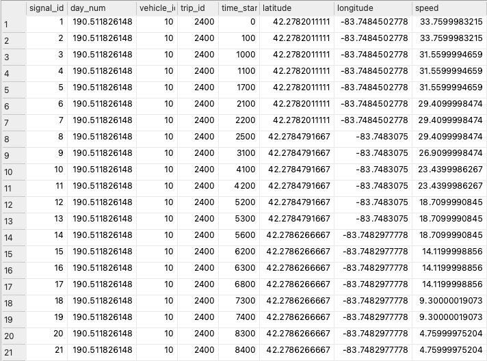

# gps-oversample
GPS oversampling using map-matching and kinematics

Modern cars, vans, and trucks are moving generators of telematics data.
Vehicle telematics data streams usually carry various signals, the GPS location being one of the most frequent.
You can also find signals such as instantaneous speed, acceleration, fuel tank or battery capacity,
and other exotic signals like windshield-wiper status and external temperature.

GPS receivers typically sample data once per second (1 Hz), which is appropriate for most applications,
but other vehicle sensors may have different signal generation frequencies. 
The signal generation frequency is programmable
and generally balances telecommunication costs and the information content's usefulness.
Some signals are sent as they change,
while others might get sent only after a given percent change to avoid unnecessary costs.

The telematics data streams have different approaches
to packaging the signal values when sending them over the wireless connection.
The most basic signal packaging approach independently sends each signal
whenever it is generated or significantly changed.
Each data packet contains the source identification, signal identification, and signal value.
Another approach is to package all signal values as a standard record whenever each value changes.
There is no preset emission frequency, and the unchanged values repeat on consecutive messages.
The final approach, similar to the previous one, fixes the emission frequency,
usually synchronized with the GPS, highlighting the importance of this signal in the process

The second approach,
which is the subject of the code in this repository, has some side effects, namely,
the repetition of the GPS coordinates on all intermediate data packets between changes in the GPS signal.
The following picture illustrates this effect on the [Extended Vehicle Energy Dataset](https://ar5iv.labs.arxiv.org/html/2203.08630) (EVED).

**Figure 1**-Data from the EVED shows how often the GPS location repeats while the vehicle moves. (Image source: Author)

It is usual to handle data, as depicted in Figure 1,
using the latitude and longitude as keys when removing duplicate rows.
This technique keeps an aggregate of all the other columns, typically the first-row value.
However, it may drastically reduce the number of rows in the dataset, rendering the data less valuable.
Between changes in the GPS signal (rows 1, 8, and 14), all other records carry the original GPS coordinates,
even if the vehicle is moving, as demonstrated by the speed signal in Figure 1 above.
We can interpolate the geographic locations of the interim records,
increasing the resolution of the GPS sensor and improving the dataset quality.
This repository illustrates
how to perform the GPS location interpolation mentioned above using map information and the speed signal.
